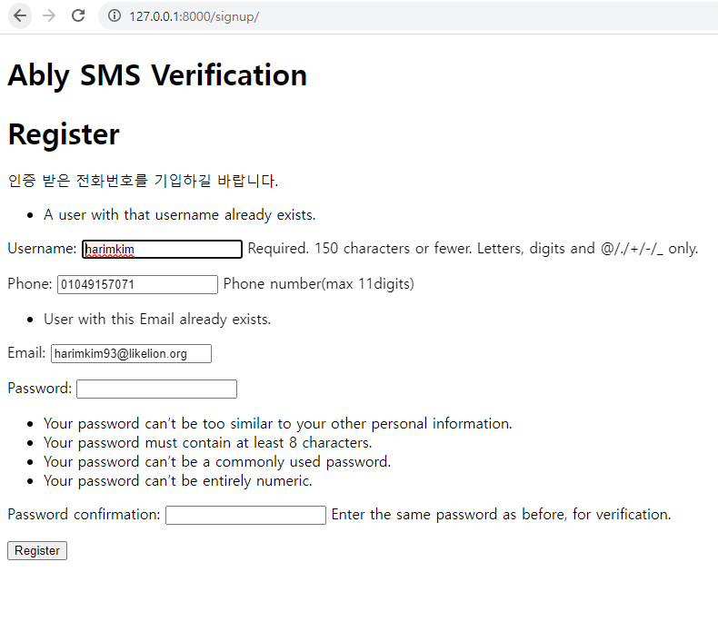

# Versions
* Django: 4.1
* Python: 3.10.4

# External library
* python-dotenv
* twilio
* requests

## 프로젝트 
* 외부 라이브러리 설치
  * <code>pip install twilio python-dotenv requests</code>
  * 그 외 필요 라이브러리 설치
* DB 초기화 
  * <code>python manage.py makemigration</code>
  * <code>python manage.py migrate</code>
* 참조 문서:
  * [Twilio Verify](https://www.twilio.com/blog/verify-phone-numbers-django-twilio-verify)
  * [Custom Login](https://beomi.github.io/2017/02/02/Django-CustomAuth/)
  * [Django Session](https://swarf00.github.io/2018/12/10/login.html)
  * [Custom Update User](https://han-py.tistory.com/147)
  * [Custom password change](https://ssungkang.tistory.com/entry/DjangoUser-%EB%B9%84%EB%B0%80%EB%B2%88%ED%98%B8-%EB%B3%80%EA%B2%BD%ED%95%98%EA%B8%B0-checkpassword)
* 데이터 베이스 초기화
  * ./db.sqlite3 삭제
  * core/migrations/ 하위 __init__.py 파일 외 전부 삭제(존재시)
  * 터미널에서 `python manager.py makemigrations` `python manager.py migrate` 실행
  

## 기능 요구 사항
* 회원 가입 기능: 
  1. 프로젝트 실행 (ex. root: localhost:8000)
  2. root page -> Register 클릭<br>
  
  3. sigup_phone_verify_page 에서 핸드폰 번호 입력 후 verify 버튼 클릭<br>
  
  4. 입력한 문자를 통해 받은 6자리 코드 입력 혹은 문자를 받은지 10분이 지나 새로운 코드 요청 진행(3번)<br>
  
  5. 회원 정보 입력(식별 가능한 정보- ID(username), 전화번호(phone), 이메일(email) 후 register 버튼 클릭<br>
  <br>
  <예시 ID:harimkim | 전화번호:01049157072 | 이메일:harimkim93@likelion.org | 비밀번호:a123123123 ><br>
     * 문자 인증을 받지 않은 전화번호 입력시, 회원 가입 중 오류 발생시 페이지 상단에 오류 표시<br>
     
  6. 회원 가입 후 로그인 재 진행(ID, 전화번호, 이메일로 로그인)<br>
  
  7. 로그인 후 내 정보 보기 클릭<br>
  8. 비밀번호 찾기(6번 하단 Find My Password 클릭)<br>
  9. 문자 인증 후 비밀번호 재설정 페이지 진입<br> 
  10. 비밀번호 인증 후 로그인 진행<br>
  
## Difficulity and Constraints
```
문자 인증을 처음으로 시도하는 의미에서 실제 동작하는(문자 인증이 되는) 과제를 완성하고자 하였습니다.
이 과정에서 외부 서비스 선정 및 해당 서비스의 적용등에서 문제를 겪었고, 이를 해결하기 위해 reference가 많은 외부 서비스를 선정하였습니다(Twilio)

외부 서비스를 연동하는 과정에서 어떤 방식으로 인증이 완료되었는지를 확인하는 과정도 필요하였으며, 이를 해결하기 위해 처음에는 db table을 생성하였으나,
구현 과정에서 불필요한 작업이 추가 된다고 판단해 스킵하였습니다. 
위 인증 완료를 위해, 논리적으로 해결하는 방식으로 풀었습니다.

문자를 요청하는 페이지에 대한 접근은 상관없이 두되, 문자로 발송된 코드를 입력하는 페이지의 경우 code 입력 form에 input hidden 타입으로 
문자를 요청한 전화번호를 같이 보내도록 하였습니다. 
이렇게 진행한 이유는, Twilio verify 서비스 자체가 인증 번호 validation시 해당 코드르 보낸 전화번호를 요청하기 때문입니다. 
(views의 signup_phone_verify, phone_verify)

또, 이 방식 외에도 세션에 전화 번호를 저장하는 방식으로 비밀번호 재 설정시에 문자 인증를 구현하였습니다.
(views의 phone_verify- signup reverify, verify_code)
이 경우 세션에 불필요한 정보가 지속적으로 남을 수 있기에 해당 데이터를 활용한 후에 삭제하는 과정도 만들었습니다.
```
